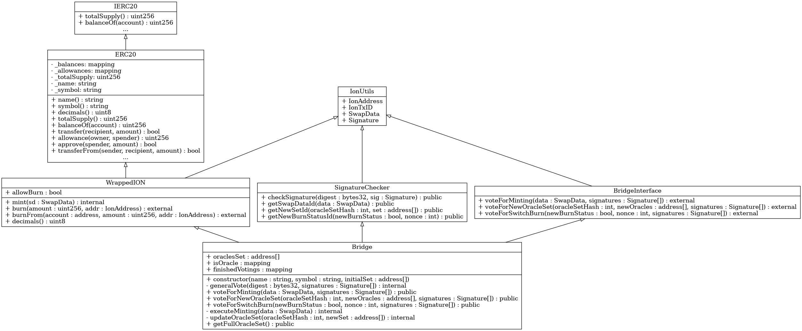

## ION - BSC Bridge Class Diagram

### Description

The class diagram represents the architecture of the **ION - BSC Bridge Solidity smart contracts** project. It illustrates the relationships and interactions between the various contracts and interfaces that facilitate the bridging of tokens between the ION blockchain and Ethereum-like blockchains (such as Binance Smart Chain).

#### Key Components:

1. **IERC20**:
   - **Type**: Interface
   - **Description**: The standard interface for ERC20 tokens as defined in the Ethereum Improvement Proposal (EIP). It declares the required functions and events for ERC20 compliance, such as `totalSupply()`, `balanceOf()`, `transfer()`, `approve()`, and `transferFrom()`.

2. **ERC20**:
   - **Type**: Contract
   - **Inherits**: `IERC20`
   - **Description**: Provides an implementation of the `IERC20` interface. It includes state variables and methods to handle token balances, allowances, and the mechanics of token transfers and approvals.

3. **IonUtils**:
   - **Type**: Interface
   - **Description**: Defines utility data structures essential for the bridge operation, including:
     - `IonAddress`: Represents an address on the ION network.
     - `IonTxID`: Represents a transaction identifier on the ION network.
     - `SwapData`: Contains data necessary for processing a token swap between ION and the Ethereum-like blockchain.
     - `Signature`: Holds information about signatures from oracles.

4. **SignatureChecker**:
   - **Type**: Contract
   - **Inherits**: `IonUtils`
   - **Description**: Responsible for verifying signatures from oracles. It ensures that any action requiring consensus is validated by the authorized oracles before execution.
   - **Key Methods**:
     - `checkSignature()`: Verifies the authenticity of a signature.
     - `getSwapDataId()`: Generates an ID for a swap operation.
     - `getNewSetId()`: Generates an ID for a new oracle set.
     - `getNewBurnStatusId()`: Generates an ID when switching the burn status.

5. **WrappedION**:
   - **Type**: Contract (Abstract)
   - **Inherits**: `ERC20`, `IonUtils`
   - **Description**: Represents the wrapped ION token on the Ethereum-like blockchain. It extends the standard ERC20 functionality to include minting and burning based on events from the ION network.
   - **Key Members**:
     - `allowBurn`: A boolean flag indicating whether burning of tokens is currently allowed.
   - **Key Methods**:
     - `mint()`: Internal method to mint new wrapped tokens.
     - `burn()`: Allows users to burn their wrapped tokens, initiating a transfer back to the ION network.
     - `burnFrom()`: Enables the burning of tokens on behalf of another user, honoring allowances.
     - `decimals()`: Overrides the default decimals to match the ION token's precision.

6. **BridgeInterface**:
   - **Type**: Interface
   - **Inherits**: `IonUtils`
   - **Description**: Defines the external functions for the bridge that require consensus from oracles. These functions are critical for maintaining the bridge's security and proper operation.
   - **Key Methods**:
     - `voteForMinting()`: Oracles vote to mint new tokens based on a swap from the ION network.
     - `voteForNewOracleSet()`: Oracles vote to update the set of authorized oracles.
     - `voteForSwitchBurn()`: Oracles vote to enable or disable the burning of tokens.

7. **Bridge**:
   - **Type**: Contract
   - **Inherits**: `WrappedION`, `SignatureChecker`, `BridgeInterface`
   - **Description**: The core contract that implements the bridge functionality. It manages the oracle consensus mechanism, minting and burning of tokens, and updating of oracle sets.
   - **Key Members**:
     - `oraclesSet`: An array of addresses representing the current set of authorized oracles.
     - `isOracle`: A mapping to quickly verify if an address is an authorized oracle.
     - `finishedVotings`: A mapping to prevent replay attacks by tracking completed votings.
   - **Key Methods**:
     - `generalVote()`: Internal method to process votes and ensure consensus.
     - `voteForMinting()`: Overrides the interface method to handle minting votes.
     - `voteForNewOracleSet()`: Overrides the interface method to handle oracle set updates.
     - `voteForSwitchBurn()`: Overrides the interface method to handle burn status changes.
     - `executeMinting()`: Internal method to mint tokens once consensus is reached.
     - `updateOracleSet()`: Internal method to update the set of authorized oracles.
     - `getFullOracleSet()`: Public method to retrieve the current set of oracles.

#### Relationships:

- **Inheritance**:
  - `ERC20` implements the `IERC20` interface.
  - `WrappedION` extends `ERC20` and implements `IonUtils`.
  - `SignatureChecker` implements `IonUtils`.
  - `BridgeInterface` implements `IonUtils`.
  - `Bridge` extends `WrappedION`, `SignatureChecker`, and `BridgeInterface`.

- **Associations**:
  - `WrappedION` uses structures from `IonUtils` for swap data and addresses.
  - `SignatureChecker` utilizes `IonUtils` for handling signatures and generating IDs.
  - `Bridge` leverages functionality from `WrappedION` for token operations and from `SignatureChecker` for validating oracle signatures.

#### Workflow Overview:

1. **Minting Process**:
   - Users initiate a transfer of ION tokens on the ION network to the bridge contract.
   - Oracles observe the ION network and, upon detecting the transfer, create a `SwapData` structure containing the details.
   - Oracles sign the `SwapData` and submit their signatures to the `Bridge` contract via `voteForMinting()`.
   - The `Bridge` contract verifies that sufficient oracles have agreed (at least two-thirds consensus) and mints the equivalent amount of wrapped ION tokens to the user's address on the Ethereum-like blockchain.

2. **Burning Process**:
   - Users can burn their wrapped ION tokens on the Ethereum-like blockchain by calling `burn()` or `burnFrom()`.
   - The `Bridge` contract burns the tokens and emits an event indicating the user's ION address and the amount burned.
   - Oracles monitor these events and, upon confirming the burn, release the corresponding ION tokens to the user's address on the ION network.
   - Burning can be enabled or disabled by oracle consensus using `voteForSwitchBurn()`.

3. **Oracle Consensus Mechanism**:
   - Actions that affect the bridge's state (like minting or updating oracles) require consensus among the authorized oracles.
   - The `generalVote()` method ensures that only valid actions signed by a sufficient number of oracles are executed.
   - To prevent replay attacks, the `finishedVotings` mapping tracks completed votes.

4. **Updating Oracles**:
   - The set of authorized oracles can be updated through the `voteForNewOracleSet()` method.
   - This change requires a two-thirds consensus among the current oracles.
   - After successful voting, the `updateOracleSet()` method replaces the old oracle set with the new one.

#### Security Considerations:

- **Signature Verification**: The `SignatureChecker` contract ensures that only valid signatures from authorized oracles are accepted, preventing unauthorized actions.
- **Consensus Requirement**: By requiring a two-thirds majority for critical operations, the bridge minimizes the risk of malicious actions if some oracles are compromised.
- **Replay Protection**: The `finishedVotings` mapping prevents the reuse of signatures, enhancing the security of the voting process.
- **Oracle Management**: The ability to update oracles allows the system to adapt over time, replacing or removing oracles as necessary to maintain security and trust.

#### Conclusion:

The class diagram and accompanying descriptions provide an overview of the smart contract architecture for the ION - BSC Bridge. The design emphasizes security, decentralization, and flexibility, ensuring that token bridging between the ION and Ethereum-like networks is handled securely via consensus among trusted oracles. Through the interplay of these contracts, users can seamlessly transfer assets between networks while benefiting from robust security mechanisms.
